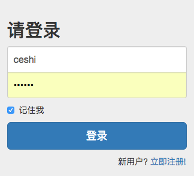
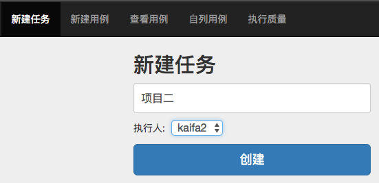
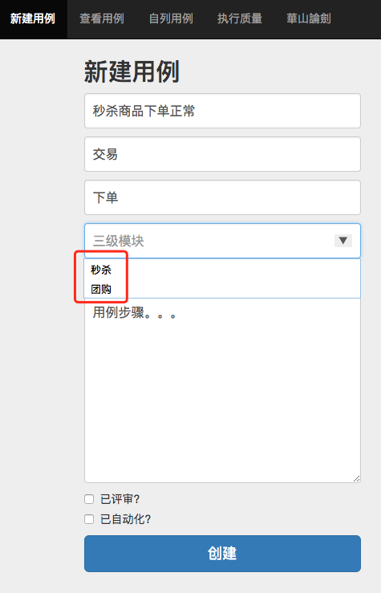
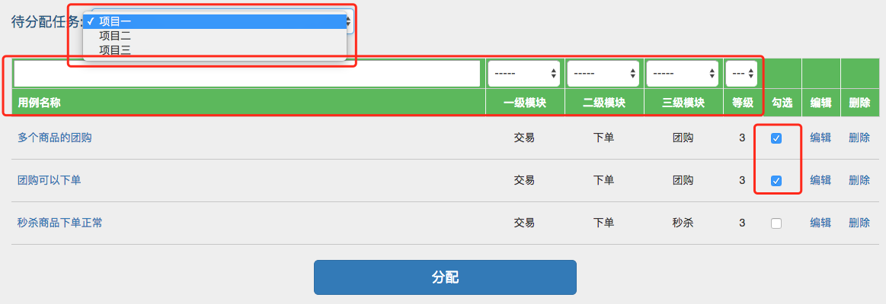
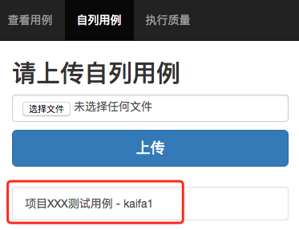
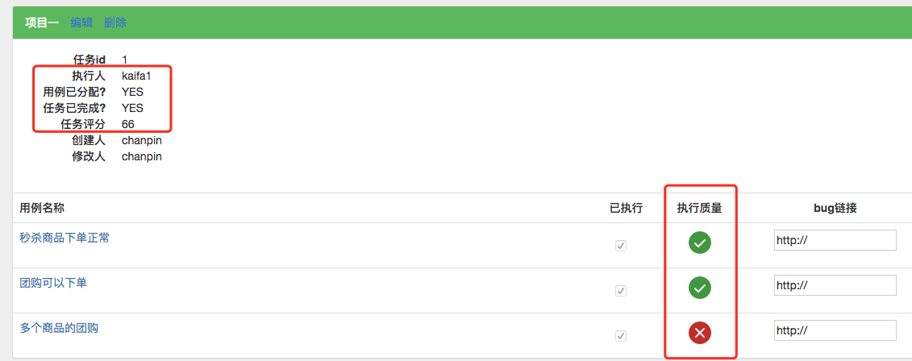
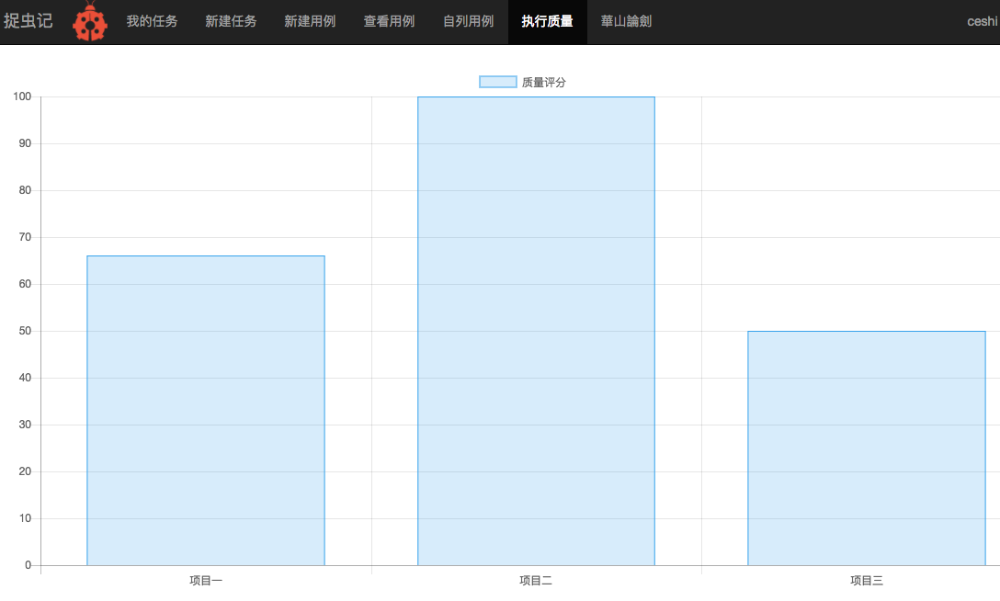
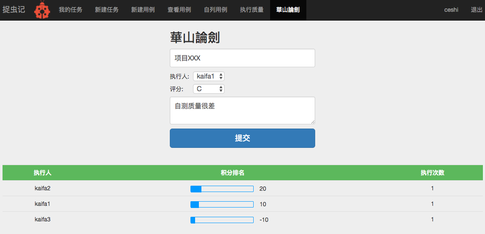

# 捉虫记

@[ Spring | Spring MVC | Mybatis ]
`有赞正在【招聘】Java、测试等岗位，有意者请将简历投递至<sunjun【@】youzan.com>`

-------------------

## 捉虫记特性

**捉虫记** 设计初衷是为了方便开发人员自测（当然了，对于需要自行完成测试的测试团队也是适用的），其主要特性为：

- **项目管理** ：由需求方发起项目，并按照`瀑布流`软件开发模型跟踪整个项目的完成情况；
- **用例管理** ：方便添加和管理测试用例，也支持Excel、Xmind等文件形式的用例上传，支持用例筛选，并为项目分配需要执行的用例；
- **项目质量报表** ：报表以时间线的方式展示各个项目的质量变化；
- **自测质量排名** ：以积分排名的方式展示项目成员自测质量高低；
- **精细化的权限控制** ：精细的角色分离（产品、开发、测试），提供精细化的权限控制，某角色可以做什么，不可以做什么一目了然；

### 典型使用场景

> **提示：**具体可参考下面`典型场景使用图示`一节，但是什么角色做什么不是绝对的，可以根据团队实际情况调整，比如，可以由测试人员发起项目。

## 使用方法

### 环境依赖
- **系统：**Linux
- **语言：**Java （Version>1.8）
- **数据库：**Mysql
- **其他工具：**Maven

### 初始化
- 修改pfcase-schema.sql中的admin账号的密码和E-mail地址（bugCatcher/src/main/resources/database/pfcase-schema.sql）  
``` sql
INSERT INTO signon VALUES('admin','Your Password');
INSERT INTO account VALUES('admin','Your E-mail address','admin');
```

- 修改jdbc.properties中的mysql配置（bugCatcher/src/main/resources/orm/jdbc.properties）
```
# local
jdbc.driverClassName=com.mysql.jdbc.Driver
jdbc.url=jdbc:mysql://<mysql host>:<mysql 端口>/pfcase
jdbc.username=<mysql 用户名>
jdbc.password=<mysql 密码>
```

- 修改setup.sh中的mysql配置（bugCatcher/setup.sh）
``` bash
#!/usr/bin/env bash

mkdir ~/fileupload
mysql -h <mysql host> -P <mysql 端口> -u <mysql 用户名> -p<mysql 密码> < <上述pfcase-schema.sql文件的绝对路径>
```

执行`setup.sh`完成初始化

### 启动
mvn tomcat7:run -Dmaven.tomcat.port=<端口号> &
>**提示：**`<端口号>`设置为任意未被占用的端口即可

以部署在本机8080端口为例，打开 http://localhost:8080/ 即能打开捉虫记登录页面


## 典型场景使用图示
### 新用户注册


#### `角色-功能对照表`
| 角色/功能 | 我的任务 | 执行用例 | 执行评价 | 新建任务 |  新建用例 | 查看用例 | 分配用例 | 上传用例 | 执行质量 | 华山论剑
| :-: | :-: | :-: | :-: | :-: | :-: | :-: | :-: | :-: | :-: | :-: |
| 测试 | 展示所有人的任务 |  —  | ○   | ○   | ○   |  ○  | ○  | ○   |  ○  |    ○  |
| 开发 | 只展示自己的任务 |○ |   —    |   ○ | ○   |   ○ |  ○ |  ○  |   ○ |   —     |
| 产品 | 只展示自己的任务 |  —  |  —     |  ○  |  ○  |   ○ |  —    |   ○ |  ○  |   —     |
| admin | 展示所有人的任务 |○| ○  |   ○ |  ○  | ○   |  ○  | ○  | ○   | ○  |
>**admin：**内置账户，拥有最高权限，可以做任何操作，慎用。

### 产品发起项目，指定项目开发人员:


### 测试设计用例，将相关用例分配给该项目的开发人员:
新建用例，模块支持新建或者选择已有的:  


选择项目，勾选该项目需要执行的用例并分配（用例支持按指定条件搜索/筛选）:  


捉虫记也支持Excel、Xmind等文件形式的用例上传，但仅做备份用例使用：  



### 开发人员执行用例
执行一条，已执行栏目下勾选一条：  


### 测试检查开发人员用例执行情况并给出评价
测试人员一条条检查下去，功能无误点击good按钮，执行不到位点击bad按钮（可以将bug链接填写上去），当项目下的用例全部执行完成以后会在项目概况下自动打分  


### 项目自测质量的打分会以图表的形式展现


### 华山论剑
此栏目主要对执行用例的开发人员进行自测质量评价，评分有A（+20）/ B（+10）/ C（-10）三个等级，具体评价标准可以自行定义，最终会给所有人员一个积分排名  


## Todo List
- bug管理与跟踪

## 反馈与建议
- 请在Issues中讨论

## License

The project is open-sourced software licensed under the [MIT license][1]


[1]: https://opensource.org/licenses/MIT